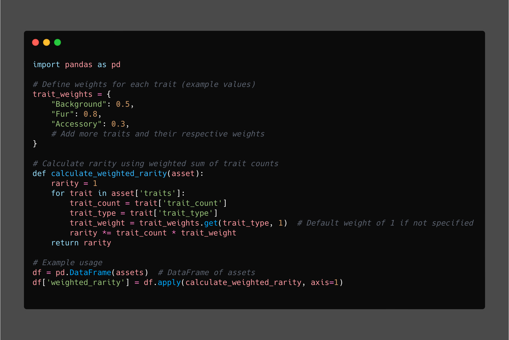
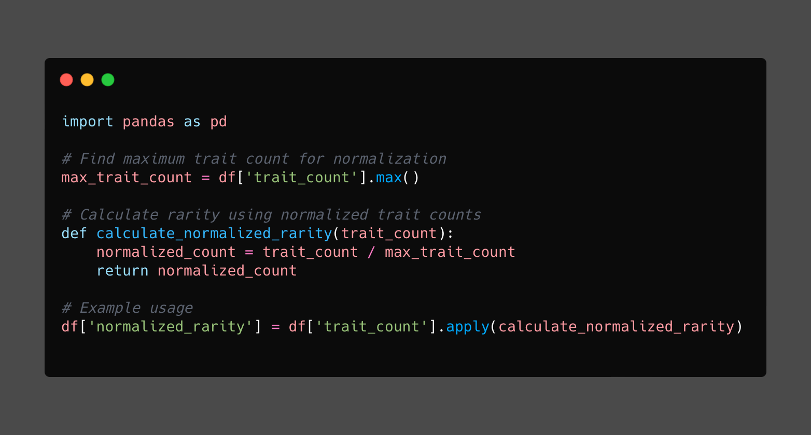
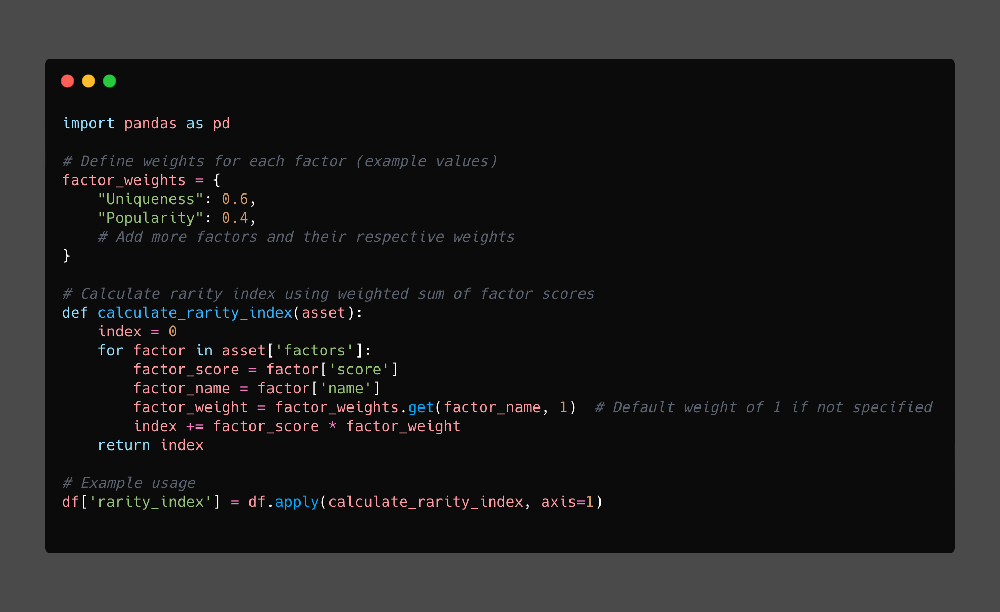
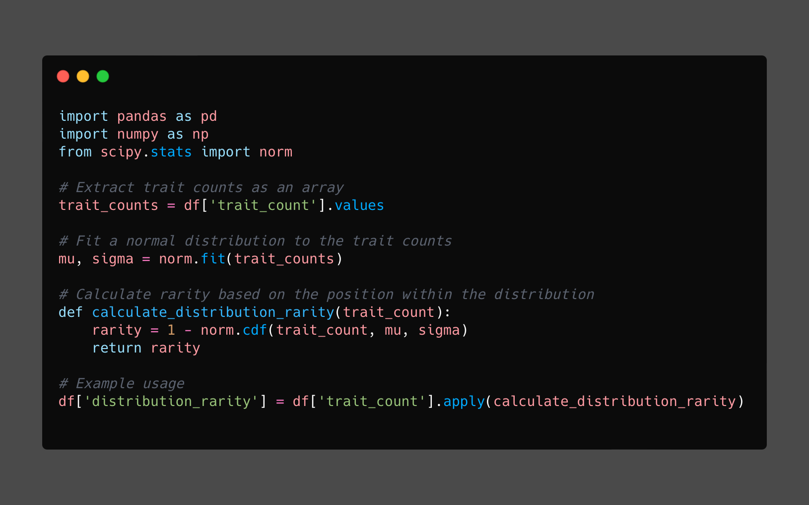

Created: Feb 1, 2021 1:13 PM
Updated: June 3, 2023 3:56 PM

# **OpenSea API Analysis Pipeline for Hedge Fund Dashboard**

Note: This project serves as an educational illustration, showcasing the organization of data pipelines, cross-team collaboration, and scalable file structure within a hedge fund. It provides valuable insights into best practices for building efficient and modular systems. However, it's important to emphasize that the specific proprietary technologies employed in the original contract cannot be shared due to the obligations of confidentiality agreements.

## **Introduction**

This comprehensive project overview encapsulates the key aspects of the OpenSea API Data Analysis project tailored specifically for a hedge fund dashboard. The project's primary aim was to proficiently extract, transform, and load data obtained from the OpenSea API, integrating it seamlessly into a bespoke dashboard.

## **Technologies Used**

To simulate the development of this project, we leverage various technologies that are commonly used in data analysis and web development:

- Programming Language: Python
- Web Development Framework: Streamlit
- Data Manipulation and Analysis: Pandas
- Web Requests: Requests
- Cryptocurrency and Blockchain Interaction: Web3

## **Project Description**

The OpenSea API NFT Data Analysis pipeline, introduced in 2021, revolutionized the integration of NFT technology and traditional finance. It seamlessly bridged the data gap by incorporating on-chain Ethereum data into hedge fund analysis, providing comprehensive and timely information for informed investment decisions in the emerging NFT market. This forward-thinking initiative showcased the project's ability to address the evolving needs of fund managers and navigate the world of digital assets. Its well-structured repository and file organization offer software engineers a valuable template to leverage Streamlit for intuitive visualization of on-chain NFT data and other applications

## **Key Features and Functionality**

The project includes the following key features:

1. **Data Retrieval:**
    - Accessing OpenSea API endpoints to retrieve asset details, events, and rarity data.
    - Structured presentation of retrieved data using tables and visualizations.
    - Rendering asset details, including names, descriptions, and images.
2. **Endpoint Customization:**
    - Streamlit app interface enabling customization of endpoint parameters for data retrieval.
    - Flexibility to specify collection, contract address, token ID, event types, owners, and collections.
3. **Asset Rarity Analysis:**
    - Evaluation of asset rarity based on the occurrence of specific traits.
    - Sorting and display of the top 20 rarest assets on the dashboard.
4. **Visualization**
    - Structured presentation of retrieved data using tables and visualizations.
    - Rendering asset details, including names, descriptions, and images.

## **Design Principles**

The project followed several software engineering design principles to ensure maintainable, reusable, and understandable code. Key aspects of the pipeline design that contribute to its scalability include:

- **`assets.py`**: Modularity
- **`event.py`**: Data Encapsulation
- **`render.py`**: Separation of Concerns
- **`api_explorer.py`**: Abstraction, Single Responsibility Principle, User Interface Separation
- **`rarity.py`**: Distribution Analysis, Rarity Metrics, & Exploratory Analysis
- **`one_file_design.py`**: Consolidation and Initial Project Structure (for reference)

- **Modularity**: The codebase is organized into separate scripts and classes, each responsible for specific functionality. This modular design enables easy maintenance, code reuse, and the ability to add or modify components independently without affecting the entire pipeline.
- **Encapsulation**: The encapsulation of functionality within classes, such as the `Asset`, `Event`, and `AssetRenderer`, promotes separation of concerns and facilitates scalability. Each class encapsulates related data and behaviors, enabling easy expansion or modification of specific components as the project evolves.
- **Abstraction**: The use of abstraction, demonstrated by the `OpenSeaAPIExplorer` class, provides a high-level interface for interacting with the OpenSea API. This abstraction allows for the addition of new API endpoints or integration with other blockchain data sources, enhancing the scalability and adaptability of the pipeline.
- **Flexibility in Data Analysis**: The pipeline's design allows for easy integration of additional data analysis techniques and algorithms. Whether it involves statistical modeling, machine learning, or advanced visualizations, the modular structure enables seamless integration and scalability of data analysis capabilities.
- **Exploratory Analysis**: The project embraces the importance of exploratory analysis, which enables deeper insights and facilitates informed decision-making. This emphasis on exploratory analysis empowers users to uncover valuable patterns and trends within the data, contributing to the project's modularity, encapsulation, and flexibility in data analysis to build scalable applications that leverage blockchain data, NFTs, and Streamlit

By leveraging the pipeline's modularity, encapsulation, abstraction, and integration capabilities, developers can scale the project to meet the demands of various use cases. This design facilitates the integration of additional data sources, implementation of advanced analytics algorithms, and customization of the user interface, making it suitable for scaling in domains such as financial institutions, research organizations, and beyond.

## **Exploratory Analysis**
The rarity calculation component in this codebase offers opportunities for deep exploration and implementation of advanced data science techniques, articulating the raw data in Pandas. By leveraging the modularity and flexibility of the code, engineers can enhance the rarity calculation to capture meaningful insights and derive precise rarity metrics for their specific use case.

Here are some key concepts and approaches that can be explored to scale the rarity component:

- **Weighted Rarity**:

    Assigning weights to each trait based on their relative importance allows for a more nuanced rarity calculation. By multiplying the `trait_count` of each trait by its corresponding weight and aggregating the weighted counts, a customizable and fine-grained rarity metric can be obtained.

    

- **Normalized Rarity**:

    Normalizing the `trait_count` values for each trait within the set of assets enables fair comparisons across different traits. Normalization involves scaling the `trait_count` values by dividing each count by the maximum count across all assets. This technique eliminates bias caused by the absolute magnitude of `trait_count` and facilitates standardized rarity assessments.

    

- **Rarity Index**:

    Instead of relying solely on `trait_count`, a rarity index can be formulated by considering multiple factors or attributes of an asset. This approach involves incorporating additional dimensions such as uniqueness, popularity, or other relevant characteristics into the rarity calculation. By assigning weights to these factors and developing a weighted formula, a comprehensive rarity index can be constructed.

    

- **Statistical Distribution**:

    Leveraging statistical distributions, such as the normal distribution or log-normal distribution, provides a probabilistic perspective on rarity. By fitting the distribution to the data and assessing the position of each asset within the distribution, a more nuanced representation of rarity can be derived. This approach captures the variance and relative rarity of assets in a statistical manner.

    By leveraging these deep concepts and technical approaches, engineers can elevate the rarity calculation in their projects. The codebase's modularity allows for easy integration of advanced techniques and facilitates the scalability of the rarity component. This flexibility opens up possibilities for applications in financial institutions, data analytics, and other domains where accurate and comprehensive rarity assessments are crucial.

    

Feel free to tailor and adapt these concepts to match the requirements and nuances of your project, unlocking the full potential of the rarity calculation in your codebase.

## **2023 Use Cases**
To further demonstrate the understanding that the project can be scaled in many directions and creative ways, several potential improvements can be considered:

1. **Real-time Data Updates with Websockets:** Enhance the project by incorporating websockets to provide real-time updates of OpenSea API data. This would allow users to receive live data feeds and enable dynamic visualization of changing asset information and events.
2. **Asynchronous Processing for Improved Performance:** Explore the use of asynchronous programming techniques, such as asynchronous functions or libraries like asyncio, to improve the performance of data retrieval and processing tasks. Asynchronous operations can optimize resource utilization and reduce the overall response time of the application.
3. **Optimizing Speed and Efficiency:** Investigate ways to optimize the project's speed and efficiency by implementing caching mechanisms for frequently accessed data, leveraging parallel processing techniques, or exploring advanced algorithms to streamline data analysis operations.
4. **Cloud Microservices Architecture**: Explore the implementation of a cloud microservices architecture to improve scalability, fault tolerance, and flexibility. Decompose the application into smaller, independent services that can be deployed and scaled independently, allowing for better resource allocation and easier maintenance.

By considering these potential improvements, the project can evolve beyond its current state and become more robust, scalable, and performant. It's worth highlighting that the existing codebase serves as an excellent boilerplate for engineers seeking modularity in their cloud microservice architecture while working with blockchain data, NFTs, and the Streamlit visualization platform. 

